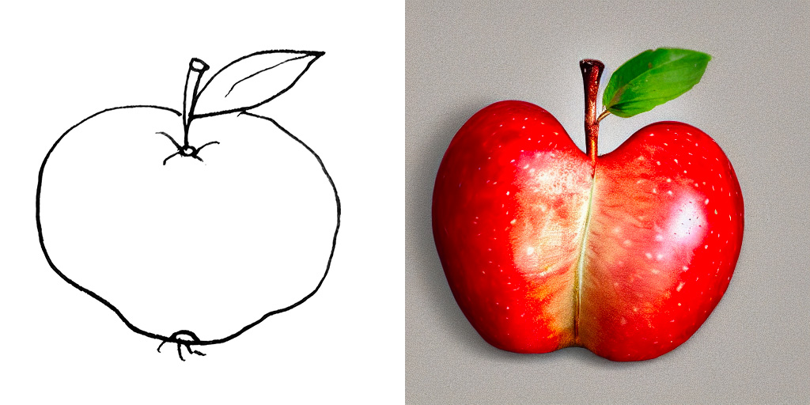

# Athena Pipeline: Research and Developmnet
Generative AI content creation pipeline, images and video.

Current state: the backbone. We have web interface for python renderer to generate images and video. 
Having limited harware we utilize old robust Stable Diffusion 1.5 model for images and CogVideoX 2b for video.
This does not produce any interesting visuals but the goal is to learn the generative pipeline.

# Google Pipeline: Nano Banana and Veo3.1

## Workflow Overview
Pipeline Strategy: "Asset-Based" Generation
To get the control, stop treating these models as "generators" and treat them as **simulators**. You need to build a pipeline that separates Assets from Shots.

### Phase 1: Asset Generation (Nano Banana)
Do not try to generate "The final shot." Generate the assets first.

- Character Sheet: Generate your character in a T-pose or neutral pose against a white background.  
Why: You need a clean "Source of Truth" image for Veo's reference input.

- Environment Plates: Generate your backgrounds as wide 16:9 or panoramic images without the character.  
Why: Veo needs to know what the world looks like before the character blocks the view.

### Phase 2: Shot Assembly (The "Sandwich" Technique)
This is the hidden technique for precise control in Veo 3.1.

- Input 1 (Context): Your Environment Image.
- Input 2 (Subject): Your Character Reference Image.
- Input 3 (Prompt): The motion description.

